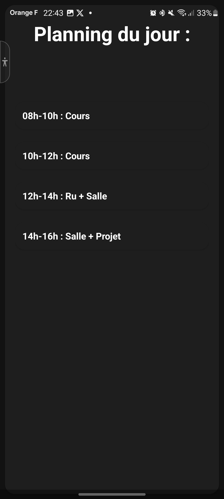

# Application de Planning avec Room Database

## Introduction
Cette application Android démontre l'implémentation d'une base de données Room pour la gestion des comptes utilisateurs et des plannings quotidiens. L'application permet aux utilisateurs de s'inscrire, de se connecter et de gérer leurs activités quotidiennes dans des créneaux horaires prédéfinis.

## Configuration et Lancement

### Prérequis
- Android Studio Arctic Fox ou plus récent
- SDK Android minimum : API 26
- Gradle 7.0 ou plus récent

### Installation
1. Clonez le dépôt :
   ```bash
   git clone [URL du dépôt]
   ```
2. Ouvrez Android Studio et sélectionnez "Open an existing project"
3. Naviguez jusqu'au répertoire du projet cloné et ouvrez-le
4. Synchronisez le projet avec Gradle
5. Lancez l'application sur un émulateur ou un appareil physique

## Interface Utilisateur

### Captures d'écran

#### Authentification et Inscription
<p align="center">
  
  
</p>

#### Gestion du Planning
<p align="center">
  
  
</p>

#### Confirmation 
<p align="center">
  

### Fonctionnalités de l'interface
- **Système d'authentification**
  - Écran de connexion avec validation des champs
  - Formulaire d'inscription complet avec validation en temps réel
  - Écran de confirmation des informations avant enregistrement

- **Gestion des plannings**
  - Interface intuitive avec 4 créneaux horaires prédéfinis
  - Création simple d'activités pour chaque créneau
  - Consultation claire des plannings existants
  - Navigation fluide entre création et consultation

- **Design moderne**
  - Thème Material Design 3
  - Support du thème sombre
  - Composants arrondis et élévations pour une meilleure hiérarchie visuelle
  - Retours visuels et animations pour une meilleure expérience utilisateur

## Structure de la Base de Données

### Implémentation Room
L'application utilise la bibliothèque Room avec une base de données unique contenant deux entités principales : User et DailyPlanning. Voici comment la base de données est configurée :

```kotlin
@Database(entities = [User::class, DailyPlanning::class], version = 2)
@TypeConverters(Converters::class)
abstract class AppDatabase : RoomDatabase() {
    abstract fun userDao(): UserDao
    abstract fun planningDao(): PlanningDao

    companion object {
        private var instance: AppDatabase? = null

        fun getInstance(context: Context): AppDatabase {
            return instance ?: synchronized(this) {
                Room.databaseBuilder(
                    context.applicationContext,
                    AppDatabase::class.java,
                    "user_registration_db"
                ).build().also { instance = it }
            }
        }
    }
}
```

### Entités

#### Entité Utilisateur
L'entité User stocke les informations de l'utilisateur, y compris les identifiants et les détails personnels :

```kotlin
@Entity(tableName = "users")
data class User(
    @PrimaryKey val login: String,
    val password: String,
    val firstName: String,
    val lastName: String,
    val birthDate: LocalDate,
    val phoneNumber: String,
    val email: String,
    val interests: List<String>
)
```

#### Entité Planning Quotidien
L'entité DailyPlanning gère les activités quotidiennes avec une relation de clé étrangère vers l'utilisateur :

```kotlin
@Entity(tableName = "daily_planning",
    foreignKeys = [
        ForeignKey(
            entity = User::class,
            parentColumns = ["login"],
            childColumns = ["userId"],
            onDelete = ForeignKey.CASCADE
        )
    ])
data class DailyPlanning(
    @PrimaryKey(autoGenerate = true) val id: Int = 0,
    val userId: String,
    val date: Long,
    val slot1Activity: String, // 08h-10h
    val slot2Activity: String, // 10h-12h
    val slot3Activity: String, // 14h-16h
    val slot4Activity: String  // 16h-18h
)
```

### Convertisseurs de Types
Pour gérer les types de données complexes dans Room, l'application implémente des convertisseurs personnalisés :

```kotlin
object Converters {
    @TypeConverter
    fun fromLocalDate(date: LocalDate): Long = date.toEpochDay()

    @TypeConverter
    fun toLocalDate(epochDay: Long): LocalDate =
        epochDay.let { LocalDate.ofEpochDay(it) }

    @TypeConverter
    fun fromInterestsList(interests: List<String>): String =
        interests.joinToString(",")

    @TypeConverter
    fun toInterestsList(interestsString: String): List<String> =
        interestsString.split(",")
}
```

## Objets d'Accès aux Données (DAOs)

### UserDao
Gère les opérations liées aux utilisateurs dans la base de données :

```kotlin
@Dao
interface UserDao {
    @Insert
    suspend fun insertUser(user: User)

    @Query("SELECT * FROM users WHERE login = :login")
    suspend fun getUserByLogin(login: String): User?

    @Query("SELECT COUNT(*) FROM users WHERE login = :login")
    suspend fun checkLoginExists(login: String): Int

    @Query("SELECT * FROM users WHERE login = :login AND password = :password")
    suspend fun checkLoginInfos(login: String, password : String) : User?
}
```

### PlanningDao
Gère les opérations de planning quotidien :

```kotlin
@Dao
interface PlanningDao {
    @Insert
    suspend fun insertPlanning(planning: DailyPlanning)

    @Query("SELECT * FROM daily_planning WHERE userId = :userId")
    fun getPlanningForUser(userId: String): Flow<List<DailyPlanning>>

    @Query("SELECT * FROM daily_planning WHERE userId = :userId AND date = :date")
    suspend fun getTodayPlanningForUser(userId: String, date: Long): DailyPlanning

    @Query("SELECT COUNT(*) FROM daily_planning WHERE userId = :userId AND date = :date")
    suspend fun checkPlanningExists(userId: String, date: Long): Int
}
```

## Détails d'Implémentation

### Gestion des Données
- Les utilisateurs sont identifiés de manière unique par leur login (clé primaire)
- Les entrées de planning sont liées aux utilisateurs par des relations de clé étrangère
- La suppression en cascade assure la suppression des plannings lors de la suppression d'un utilisateur

### Gestion des États
L'application utilise des ViewModels pour gérer l'état de l'interface et les opérations de données :

```kotlin
class PlanningViewModel : ViewModel() {
    private val _currentFragment = MutableLiveData<String>()
    val currentFragment: LiveData<String> = _currentFragment

    // Gestion de l'ID utilisateur
    private val _userId = MutableLiveData<String>()
    val userId: LiveData<String> = _userId

    // Gestion des créneaux de planning
    private val _first = MutableLiveData<String>()
    val first: LiveData<String> = _first
    // ... implémentation similaire pour les autres créneaux
}
```

### Fonctionnalités Principales

1. **Authentification Utilisateur**
   - Système de connexion/inscription sécurisé
   - Persistance des données utilisateur avec Room
   - Validation des champs d'inscription

2. **Planning Quotidien**
   - Quatre créneaux horaires par jour (8-10h, 10-12h, 14-16h, 16-18h)
   - Attribution d'activités aux créneaux horaires
   - Récupération des plannings par utilisateur et par date

3. **Relations de Données**
   - Relation one-to-many entre User et DailyPlanning
   - Suppression en cascade des plannings associés
   - Conversion des types de données complexes
